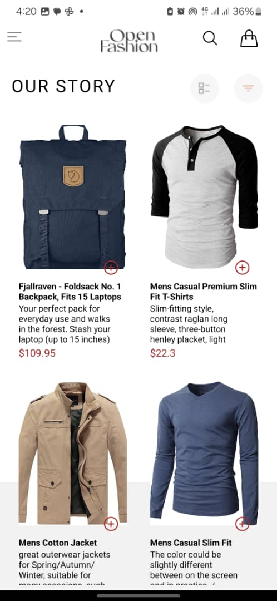
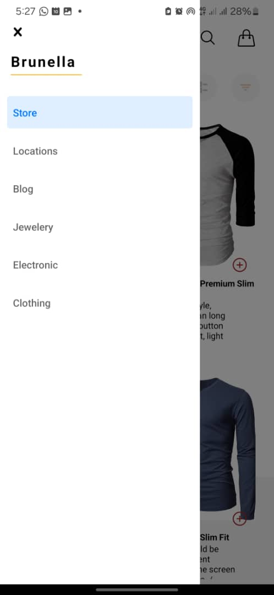
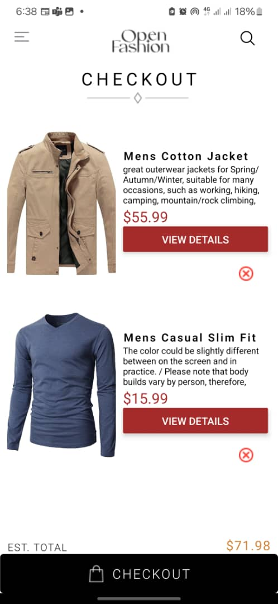
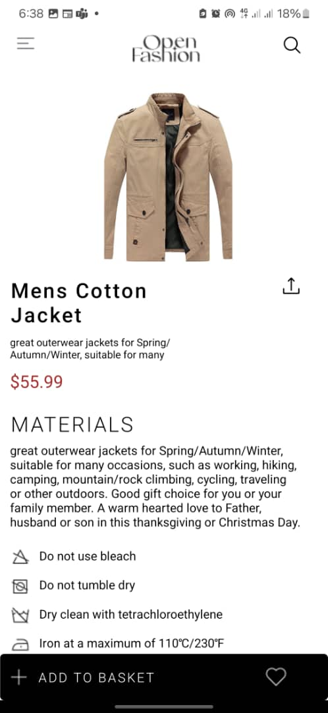
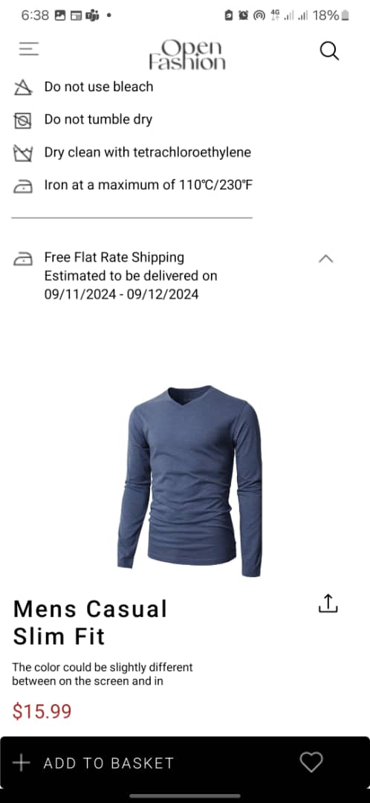

# Open fashion App

## Description

This project is a mobile application for an ecommerce fashion store. It allows users to browse and purchase various dresses on sale. The app provides functionalities to add and remove items from the cart, and it stores selected items locally on the device using AsyncStorage.

## Design Choices

### User Interface

Key design elements include:

Navigation: The app uses drawer tab navigation for easy access to the Store screen, CartScreen and other screens like the Clothing,Jewelery,Locations and other screens.

Layout:

1. The HomeScreen displays products in a grid format(two columns), making it easy for users to browse through items.
2. The CartScreen displays products in a single column, making it easy for users to view, remove items from the cart.(A details button links users to the Details page).
3. The details page displays products in a single absolute column, making it easy for users to view extra details about products and verify that they are in the cart by clicking on the footer.

Interactivity: Users can add items to their cart directly from the product list in the homescreen. The cart icon navigates the user to the Cartscreen which displays the total number of items added to the cart and their respective prices and total.
On the Cartscreen, buttons have been added to the products that navigate users to the Details screen to view the details of the products and confirm purchase.

Consistency: The design maintains consistency in colors, fonts, and iconography, ensuring a cohesive look and feel.

### Data Storage

To implement data storage, the app fetches data from the API and stores it locally using AsyncStorage. This allows users to access their tasks even when offline, ensuring a seamless user experience. The use of AsyncStorage also provides a reliable and efficient way to store and retrieve data.

## Screenshots

Here are some screenshots of the app:

